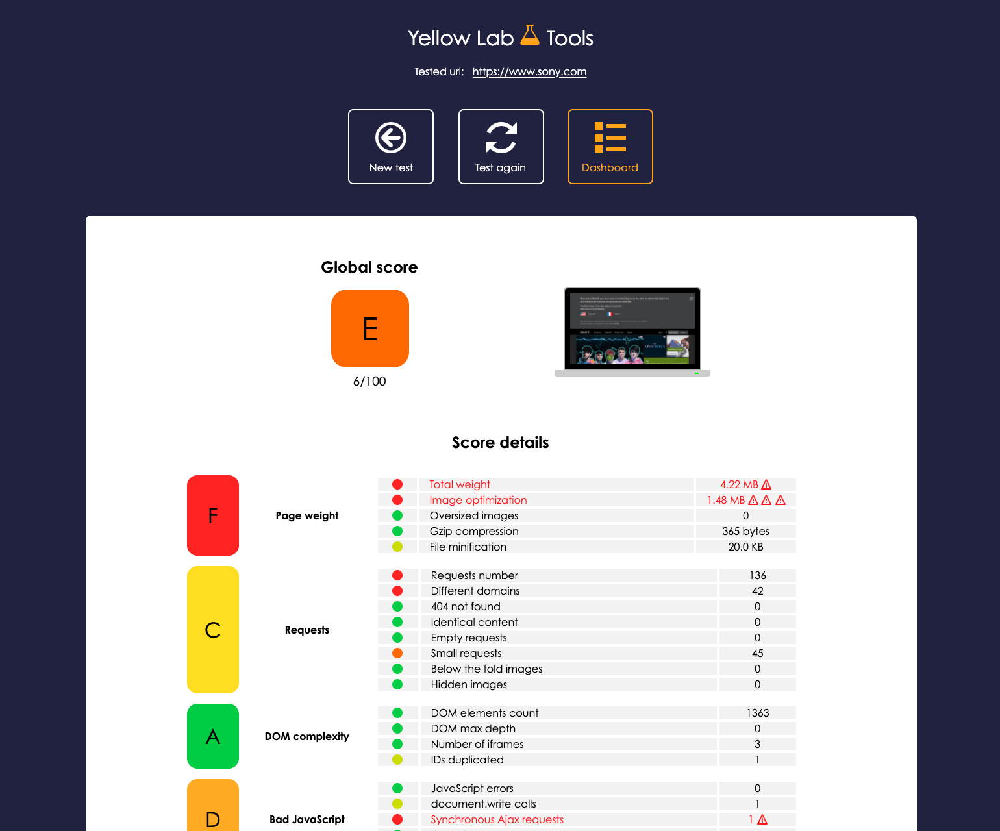

</img>

Analyzes a webpage and detects **performance** or **front-end code quality** issues. Free, easy to launch, easy to understand, in-depth details.

#  

</img>

<table>
    <tr>
        <td width="70%">
            The <b>online tool</b> (recommended): 
            <a href="http://yellowlab.tools" target="_blank">http://yellowlab.tools</a>
        </td>
        <td width="30%">
            </img>
        </td>
    </tr>
    <tr>
        <td width="70%">
            The <b>CLI</b> (Command Line Interface) - <a href="https://github.com/gmetais/YellowLabTools/wiki/Command-Line-Interface" target="_blank">Doc here</a>
        </td>
        <td width="30%">
            </img>
        </td>
    </tr>
    <tr>
        <td width="70%">
            The <b>Grunt task</b>: <a href="https://github.com/gmetais/grunt-yellowlabtools" traget="_blank">gmetais/grunt-yellowlabtools</a>
             For developers or Continuous Integration
        </td>
        <td width="30%">
            </img>
        </td>
    </tr>
    <tr>
        <td width="70%">
            The <b>NodeJS</b> package - <a href="https://github.com/gmetais/YellowLabTools/wiki/NodeJS-module" target="_blank">Doc here</a>
        </td>
        <td width="30%">
            </img>
        </td>
    </tr>
    <tr>
        <td width="70%">
            The <b>public API</b> - <a href="https://github.com/gmetais/YellowLabTools/wiki/Public-API" target="_blank">Doc here</a>
             
            Allows you to launch runs from any language
        </td>
        <td width="30%">
            </img>
        </td>
    </tr>
</table>

## How it works

The tool loads the given URL via [PhantomJS](http://phantomjs.org/) (a headless browser) and collects various metrics and statistics with the help of [Phantomas](https://github.com/macbre/phantomas). These metrics are then categorized and transformed into scores. It also gives in-depth details so developpers can fix the detected issues.

By the way, it's free because we are geeks, not businessmen. All we want is a ★ on GitHub, it will boost our motivation to add more awesome features!!!

## Test your localhost

You can use [ngrok](https://ngrok.com/), a tool that creates a secure tunnel between your localhost and the online tool (or the public API). You can also use the CLI or the Grunt tasks as they run on your machine.

## Install your own private instance

If your project is not accessible from outside, or if you want to fork and improve the tool, you can build your own instance. The documentation is [here](https://github.com/gmetais/YellowLabTools/wiki/Install-your-private-server).

## Author
Gaël Métais. I'm a webperf freelance. Follow me on Twitter [@gaelmetais](https://twitter.com/gaelmetais), I tweet about Web Performances, Front-end and new versions of YellowLabTools!

If you understand French, you can visit [my website](http://www.gaelmetais.com) (will be soon in English too).

## Contributors
- Achraf Ben Younes [achrafbenyounes](https://github.com/achrafbenyounes)
- [camlafit](https://github.com/camlafit)
- Vincent L. [magikcypress](https://github.com/magikcypress)
- Ousama Ben Younes [ousamabenyounes](https://github.com/ousamabenyounes)

